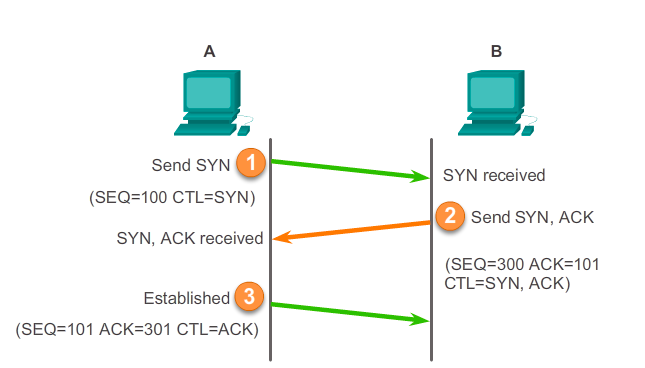
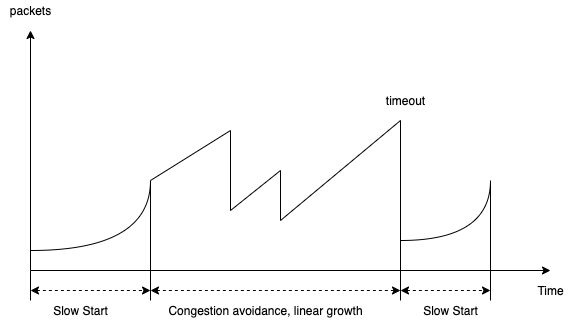
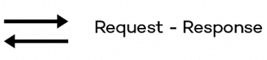

# RSocket protocol

## Протокол TCP

Для того чтобы понять, почему использование классического Request-Response через HTTP/1.1 нам не подходит, нужно
посмотреть на некоторые аспекты протокола TCP.

HTTP/1.1 для каждого цикла взаимодействия создает TCP соединение с сервером. Процесс установки TCP соединения называется
трехфазным рукопожатием и выглядит следующим образом:



Получается, для установки соединения тратится 1.5 RTT (Round Trip Time) и так на каждый запрос, что сказывается на
утилизации ресурсов.

Вторым важным аспектом является то, что сетевая инфраструктура сейчас очень мощная, а значит скорость передачи данных
может быть очень большой (100Mb/s+), но после установки соединения нет информации о доступной скорости передачи данных,
а значит скорость передачи начинается с маленьких значений и постепенно увеличивается в процессе передачи _большого_
объема данных.

Объем передаваемых данных определяется размером окна отправителя. Для управления размером окна используется механизм
управления перегрузкой Congestion Control – динамическое изменение размера окна отправителя.

##### Аддитивное увеличение, мультипликативное уменьшение

При получении каждого подтверждения мы прибавляем к размеру окна некоторое значение, обычно это MSS, а при появлении
перегрузки уменьшаем размер окна в два раза.

##### Медленный старт

Первоначально размер окна устанавливается маленьким, при каждом подтверждении размер окна увеличивается на 2, происходит
экспоненциальный рост размера окна. После сигнала о перегрузке размер окна снова становится минимальным.

##### Комбинированный вариант

На практике в TCP используется комбинация методов аддитивного увеличения, мультипликативного уменьшения и медленного
страта. Для того чтобы быстро заполнить пропускную способность используется медленный старт, после того, как случилась
первая перегрузка размер окна уменьшается вдвое – порог медленного старта, и после этого уже используется метод
аддитивного увеличения, мультипликативного уменьшения.



## RSocket

RSocket – двоичный протокол point–point, обеспечивающий семантику Reactive Streams. Протокол RSocket определяет именно
протокол кодирования и кадров передачи данных без привязки к транспорту. В роли транспорта может выступать:

* TCP;
* WebSocket;
* HTTP/2 Stream;
* Aeron.

##### Мотивация

Главная задача протокола – реализовать удобный и эффективный протокол, реализующий концепцию Reactive Streams и
поддерживающий как форматы запрос–ответ, так и streaming.

##### Стратегии использования

1. Request-Response — отправляет сообщение и получает результат.
   
1. Request-Stream — отправляет сообщение и получает обратно поток данных.
   
1. Channel — отправляет потоки сообщений в обоих направлениях.
   
1. Fire-and-Forget — предназначен для передачи данных от отправителя к получателю, в котором отправитель не заботится о
   результате операции — он отправил запрос и забыл о нем.
   

##### Внутреннее устройство

## Примеры

```shell
$ ./gradlew clean build

$ curl http://localhost:8080/api/v1/generate

$ brew install making/tap/rsc

$ rsc --route generate --debug tcp://localhost:7090
2021-12-24 00:46:34.099 DEBUG 9089 --- [actor-tcp-nio-2] io.rsocket.FrameLogger                   : sending -> 
Frame => Stream ID: 0 Type: SETUP Flags: 0b0 Length: 75
Data:

2021-12-24 00:46:34.100 DEBUG 9089 --- [actor-tcp-nio-2] io.rsocket.FrameLogger                   : sending -> 
Frame => Stream ID: 1 Type: REQUEST_RESPONSE Flags: 0b100000000 Length: 22
Metadata:
         +-------------------------------------------------+
         |  0  1  2  3  4  5  6  7  8  9  a  b  c  d  e  f |
+--------+-------------------------------------------------+----------------+
|00000000| fe 00 00 09 08 67 65 6e 65 72 61 74 65          |.....generate   |
+--------+-------------------------------------------------+----------------+
Data:

2021-12-24 00:46:34.227 DEBUG 9089 --- [actor-tcp-nio-2] io.rsocket.FrameLogger                   : receiving -> 
Frame => Stream ID: 1 Type: NEXT_COMPLETE Flags: 0b1100000 Length: 194
Data:
         +-------------------------------------------------+
         |  0  1  2  3  4  5  6  7  8  9  a  b  c  d  e  f |
+--------+-------------------------------------------------+----------------+
|00000000| d1 82 d1 8b 20 d1 87 d1 83 d0 b5 d1 88 d1 8c 3f |.... ..........?|
|00000010| 20 d0 b2 d0 ba d1 83 d1 81 d0 bd d0 be d0 b5 20 | .............. |
|00000020| d1 80 d0 be d0 b6 d0 b4 d0 b5 d0 bd d1 8c d0 b5 |................|
|00000030| 20 d0 bf d0 b5 d1 80 d0 b5 d0 b4 d0 be d0 bc d0 | ...............|
|00000040| be d0 bd d0 be d0 b9 20 d1 81 d1 82 d0 b8 d1 85 |....... ........|
|00000050| d0 be d0 b2 20 d0 bb d0 b8 d1 81 d1 82 d1 8b 20 |.... .......... |
|00000060| d0 ba d0 b0 d0 ba 20 d0 b4 d0 b5 d1 82 d0 be d1 |...... .........|
|00000070| 80 d0 be d0 b4 d0 bd d0 be d0 b5 20 d0 bf d0 b0 |........... ....|
|00000080| d1 80 d0 b5 d0 bd d1 8c d0 b5 20 d0 ba d0 b0 d0 |.......... .....|
|00000090| ba 20 d1 81 d0 bf d0 b0 d1 80 d1 82 d0 b0 20 d0 |. ............ .|
|000000a0| b3 d1 80 d1 8f d0 b7 d0 bd d0 be d0 b9 20 d1 81 |............. ..|
|000000b0| d1 80 d0 b0 d0 bc d0 be d1 82 d1 8b             |............    |
+--------+-------------------------------------------------+----------------+
```

#### Stress testing

```shell
$ brew install k6

$ k6 run --out influxdb=http://localhost:8086/k6 scripts/k6.js
```

Для просмотра используемых потоков использовать параметры запуска:

```shell
-Djava.rmi.server.hostname=localhost \
  -Dcom.sun.management.jmxremote.port=1199 \
  -Dcom.sun.management.jmxremote.authenticate=false 
```

## Литература

1. [Protocol](https://rsocket.io/about/protocol)
1. [RSocket протокол по-русски](https://medium.com/@kirill.sereda/rsocket-%D0%BF%D1%80%D0%BE%D1%82%D0%BE%D0%BA%D0%BE%D0%BB-2ed25dc920ba)
1. [Олег Докука — Протокол RSocket — будущее реактивных приложений](https://www.youtube.com/watch?v=tSVjUKZ8Eg8)
1. [Олег Докука — RSocket to bring the next generation of Service Mesh](https://www.youtube.com/watch?v=o19I2_FxBNg)