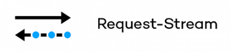
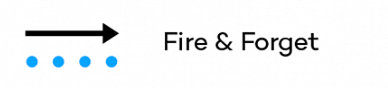

# RSocket protocol

## Протокол TCP

Для того чтобы понять, почему использование классического Request-Response через HTTP/1.1 нам не подходит, нужно
посмотреть на некоторые аспекты протокола TCP.

HTTP/1.1 для каждого цикла взаимодействия создает TCP соединение с сервером. Процесс установки TCP соединения называется
трехфазным рукопожатием и выглядит следующим образом:


Получается, для установки соединения тратится 1.5 RTT (Round Trip Time) и так на каждый запрос, что сказывается на
утилизации ресурсов.

Вторым важным аспектом является то, что сетевая инфраструктура сейчас очень мощная, а значит скорость передачи данных
может быть очень большой (100Mb/s+), но после установки соединения нет информации о доступной скорости передачи данных,
а значит скорость передачи начинается с маленьких значений и постепенно увеличивается в процессе передачи _большого_
объема данных.

Объем передаваемых данных определяется размером окна отправителя. Для управления размером окна используется механизм
управления перегрузкой Congestion Control – динамическое изменение размера окна отправителя.

##### Аддитивное увеличение, мультипликативное уменьшение

При получении каждого подтверждения мы прибавляем к размеру окна некоторое значение, обычно это MSS, а при появлении
перегрузки уменьшаем размер окна в два раза.

##### Медленный старт

Первоначально размер окна устанавливается маленьким, при каждом подтверждении размер окна увеличивается на 2, происходит
экспоненциальный рост размера окна. После сигнала о перегрузке размер окна снова становится минимальным.

##### Комбинированный вариант

На практике в TCP используется комбинация методов аддитивного увеличения, мультипликативного уменьшения и медленного
страта. Для того чтобы быстро заполнить пропускную способность используется медленный старт, после того, как случилась
первая перегрузка размер окна уменьшается вдвое – порог медленного старта, и после этого уже используется метод
аддитивного увеличения, мультипликативного уменьшения.


## RSocket

RSocket – двоичный протокол Point-To–Point, обеспечивающий семантику Reactive Streams. Протокол RSocket определяет
именно протокол кодирования и кадров передачи данных без привязки к транспорту. В роли транспорта может выступать:

* TCP;
* WebSocket;
* HTTP/2 Stream;
* Aeron.

### Мотивация

Предположим, есть сервисы, которые общаются друг с другом по HTTP (REST API).

Первая проблема — модель взаимодействия запрос/ответ HTTP . Некоторые шаблоны коммуникации трудно реализовать
эффективным способом, используя модель взаимодействия запрос / ответ. Даже выполнение простой операции Fire–And–Forget
имеет побочные эффекты — сервер должен отправить ответ обратно клиенту, даже если клиенту это не нужно. Вторая проблема
— производительность. Обмен сообщениями на основе RabbitMQ/Kafka, gRPC или даже HTTP/2 с его поддержкой
мультиплексирования будет намного лучше с точки зрения производительности и эффективности, чем простой HTTP/1.1.

Главная задача протокола – реализовать удобный и эффективный протокол, реализующий концепцию Reactive Streams и
поддерживающий как форматы запрос–ответ, так и streaming.

#### gRPC vs RSocket

gRPC и RSocket пытаются решить разные проблемы. gRPC — это среда RPC, использующая HTTP/2, т.е. он находится на L7 OSI –
т.е. RPC поверх прикладного HTTP/2. При взаиможействии из браузера (если нет поддержки HTTP/2) gRPC взаимодействует
через Envoy Proxy, т.е. до proxy выполняются POST запрос HTTP/1.1, а от Envoy до приложения уже испольузется HTTP/2.

RSocket — это уровень OSI 5/6, который моделирует семантику Reactive Streams по сети. Реактивные потоки позволяют
моделировать асинхронные потоки с backpressure.

gRPC предназначен для работы с семантикой HTTP/2. Если вы хотите отправить его через другой транспорт, вы должны
имитировать семантику HTTP/2. По всей сети он фактически связан с HTTP/2 и TCP.

RSocket требуется только дуплексное соединение — т.е. то, что может отправлять и получать байты. Это может быть TCP,
WebSockets и т. д.

RSocket не имеет взаимодействия клиент-сервер в традиционном смысле HTTP. В RSocket, когда клиент подключается к
серверу, они оба могут быть запросчиком и ответчиком. Это означает, что после того, как они подключены, RSocket является
полностью дуплексным, и запрашивающая сторона сервера может инициировать вызовы запрашивающей стороне клиента — то есть
сервер может совершать вызовы в веб-браузер после подключения.

#### WebSocket vs RSocket

WebSocket не обеспечивают BackPressure на уровне приложения, только backpressure на уровне байтов на основе TCP.
WebSocket также обеспечивают только создание, они не обеспечивают семантику приложения. Разработчик должен разработать
протокол приложения для взаимодействия с WebSocket.

RSocket обеспечивает кадрирование, семантику приложения, backpressure на уровне приложения, и оно не привязано к
конкретному транспорту.

### Стратегии использования

1. Request-Response — отправляет сообщение и получает результат.<br>
   
2. Request-Stream — отправляет сообщение и получает обратно поток данных.<br>
   
3. Channel — отправляет потоки сообщений в обоих направлениях.<br>
   
4. Fire-and-Forget — предназначен для передачи данных от отправителя к получателю, в котором отправитель не заботится о
   результате операции — он отправил запрос и забыл о нем.<br>
   

### Внутреннее устройство

RSocket использует кадрирование. Кадр (`Frame`) RSocket — это отдельное сообщение, которое содержит запрос, ответ или
обработку протокола. К кадру RSocket может добавляться 24-битное поле длины кадра (`Frame Length`), представляющее длину
кадра в байтах. Зависит от базового транспортного протокола, используемого RSocket, поле длины кадра может не
требоваться.

Общая структура сообщения:

```
 0                   1                   2
 0 1 2 3 4 5 6 7 8 9 0 1 2 3 4 5 6 7 8 9 0 1 2 3
+-+-+-+-+-+-+-+-+-+-+-+-+-+-+-+-+-+-+-+-+-+-+-+-+
|                    Frame Length               |
+-----------------------------------------------+
|                RSocket Frame          ...
|
+-----------------------------------------------+
```

Каждый кадр состоит из заголовка кадра (`RSocket Frame`), который содержит идентификатор потока, определение типа кадра
и другие данные, относящиеся к типу кадра. За заголовком кадра следуют метаданные и полезная нагрузка — эти части несут
данные, указанные пользователем. Данные и метаданные могут быть закодированы в разных форматах. Кадры отправляются в
виде потока байтов. Если объем кадра большой, то он разбивается на фрагменты (`Fragment`) и каждому кадру добавляется
порядковый номер фрагмента.

Кадр с метаданными и полезной нагрузкой:

```
 0                   1                   2                   3
 0 1 2 3 4 5 6 7 8 9 0 1 2 3 4 5 6 7 8 9 0 1 2 3 4 5 6 7 8 9 0 1
+-+-+-+-+-+-+-+-+-+-+-+-+-+-+-+-+-+-+-+-+-+-+-+-+-+-+-+-+-+-+-+-+
|              Metadata Length                  |
+---------------------------------------------------------------+
|                       Metadata Payload                       ...
+---------------------------------------------------------------+
|                       Payload of Frame                       ...
+---------------------------------------------------------------+
```

Формат заголовка кадра:

```
 0                   1                   2                   3
 0 1 2 3 4 5 6 7 8 9 0 1 2 3 4 5 6 7 8 9 0 1 2 3 4 5 6 7 8 9 0 1
+-+-+-+-+-+-+-+-+-+-+-+-+-+-+-+-+-+-+-+-+-+-+-+-+-+-+-+-+-+-+-+-+
|                         Stream ID = 0                         |
+-----------+-+-+---------------+-------------------------------+
|Frame Type |0|0|    Flags      |
+-------------------------------+-------------------------------+
|0|                                                             |
+               Last Received Client Position                   +
|                                                               |
+---------------------------------------------------------------+
```

* Stream ID – ID потока для этого кадра или 0, если это единственный кадр в соединении;
* Frame Type – тип кадра;
* Fags – флаги зависят от типа кадра, но все типы кадров должны иметь зарезервированное место для флага I (Ignore) –
  если фрем не распознан, M (Metadata) – флаг, указывающий, что присутствуют метаданные.

RSocket использует мультеплексирвоание, т.е. создает каналы поверх единственного TCP соединения. Каждый поток имеет свой
уникальный идентификатор.

RSocket не различает клиента и сервер после фазы настройки соединения. Каждая сторона может начать отправку данных
другой — это делает протокол почти полностью симметричным.

#### Типы кадров

|        Тип       | Значение | Описание                                                                                                       |
|------------------|----------|----------------------------------------------------------------------------------------------------------------|
| RESERVED         |   0x00   | зарезервировано                                                                                                |
| SETUP            |   0x01   | установка соединения, отправляется клиентом для инициации процесса обмена сообещниями                          |
| LEASE            |   0x02   | отправляется принимающей стороной, чтобы известить сколько сообщений она готова обработать за указанный период |
| KEEPALIVE        |   0x03   | keepalive                                                                                                      |
| REQUEST_RESPONSE |   0x04   | ответ за запрос                                                                                                |
| REQUEST_FNF      |   0x05   | сообщение без подтверждения доставки                                                                           |
| REQUEST_STREAM   |   0x06   | клиент ожидает стрим данных в ответ на свой запрос                                                             |
| REQUEST_CHANNEL  |   0x07   | запрашивается двунаправленный канал данных                                                                     |
| REQUEST_N        |   0x08   | запрашивается еще N значений                                                                                   |
| CANCEL           |   0x09   | отмена невыполненного запроса                                                                                  |
| PAYLOAD          |   0x0A   | полезная нагрузка (для Reactive Stream onNext)                                                                 |
| ERROR            |   0x0B   | ошибка                                                                                                         |
| METADATA_PUSH    |   0x0C   | push с асинхронными метаданными                                                                                |
| RESUME           |   0x0D   | возобновление обмена сообщениями                                                                               |
| RESUME_OK        |   0x0E   | подтверждение, что возобновление возможно                                                                      |
| EXT              |   0x3F   | зарезервировано для расширения протокола                                                                       |

## Примеры

```shell
$ ./gradlew clean build

$ curl http://localhost:8080/api/v1/generate

$ brew install making/tap/rsc

$ rsc --route generate --debug tcp://localhost:7090
2021-12-24 00:46:34.099 DEBUG 9089 --- [actor-tcp-nio-2] io.rsocket.FrameLogger                   : sending -> 
Frame => Stream ID: 0 Type: SETUP Flags: 0b0 Length: 75
Data:

2021-12-24 00:46:34.100 DEBUG 9089 --- [actor-tcp-nio-2] io.rsocket.FrameLogger                   : sending -> 
Frame => Stream ID: 1 Type: REQUEST_RESPONSE Flags: 0b100000000 Length: 22
Metadata:
         +-------------------------------------------------+
         |  0  1  2  3  4  5  6  7  8  9  a  b  c  d  e  f |
+--------+-------------------------------------------------+----------------+
|00000000| fe 00 00 09 08 67 65 6e 65 72 61 74 65          |.....generate   |
+--------+-------------------------------------------------+----------------+
Data:

2021-12-24 00:46:34.227 DEBUG 9089 --- [actor-tcp-nio-2] io.rsocket.FrameLogger                   : receiving -> 
Frame => Stream ID: 1 Type: NEXT_COMPLETE Flags: 0b1100000 Length: 194
Data:
         +-------------------------------------------------+
         |  0  1  2  3  4  5  6  7  8  9  a  b  c  d  e  f |
+--------+-------------------------------------------------+----------------+
|00000000| d1 82 d1 8b 20 d1 87 d1 83 d0 b5 d1 88 d1 8c 3f |.... ..........?|
|00000010| 20 d0 b2 d0 ba d1 83 d1 81 d0 bd d0 be d0 b5 20 | .............. |
|00000020| d1 80 d0 be d0 b6 d0 b4 d0 b5 d0 bd d1 8c d0 b5 |................|
|00000030| 20 d0 bf d0 b5 d1 80 d0 b5 d0 b4 d0 be d0 bc d0 | ...............|
|00000040| be d0 bd d0 be d0 b9 20 d1 81 d1 82 d0 b8 d1 85 |....... ........|
|00000050| d0 be d0 b2 20 d0 bb d0 b8 d1 81 d1 82 d1 8b 20 |.... .......... |
|00000060| d0 ba d0 b0 d0 ba 20 d0 b4 d0 b5 d1 82 d0 be d1 |...... .........|
|00000070| 80 d0 be d0 b4 d0 bd d0 be d0 b5 20 d0 bf d0 b0 |........... ....|
|00000080| d1 80 d0 b5 d0 bd d1 8c d0 b5 20 d0 ba d0 b0 d0 |.......... .....|
|00000090| ba 20 d1 81 d0 bf d0 b0 d1 80 d1 82 d0 b0 20 d0 |. ............ .|
|000000a0| b3 d1 80 d1 8f d0 b7 d0 bd d0 be d0 b9 20 d1 81 |............. ..|
|000000b0| d1 80 d0 b0 d0 bc d0 be d1 82 d1 8b             |............    |
+--------+-------------------------------------------------+----------------+
```

#### Stress testing

```shell
# запускаем Grafana, Prometheus (для метрик Spring Boot), Influx
$ docker compose up -d

$ brew install k6

# запускаем нагрузку на наше приложение
$ k6 run --out influxdb=http://localhost:8086/k6 scripts/k6.js

# открываем браузер и смотрим http://localhost:3000
```

Для просмотра используемых потоков использовать параметры запуска:

```shell
-Djava.rmi.server.hostname=localhost \
  -Dcom.sun.management.jmxremote.port=1199 \
  -Dcom.sun.management.jmxremote.authenticate=false 
```

## Литература

1. [Protocol](https://rsocket.io/about/protocol)
1. [RSocket протокол по-русски](https://medium.com/@kirill.sereda/rsocket-%D0%BF%D1%80%D0%BE%D1%82%D0%BE%D0%BA%D0%BE%D0%BB-2ed25dc920ba)
1. [Олег Докука — Протокол RSocket — будущее реактивных приложений](https://www.youtube.com/watch?v=tSVjUKZ8Eg8)
1. [Олег Докука — RSocket to bring the next generation of Service Mesh](https://www.youtube.com/watch?v=o19I2_FxBNg)